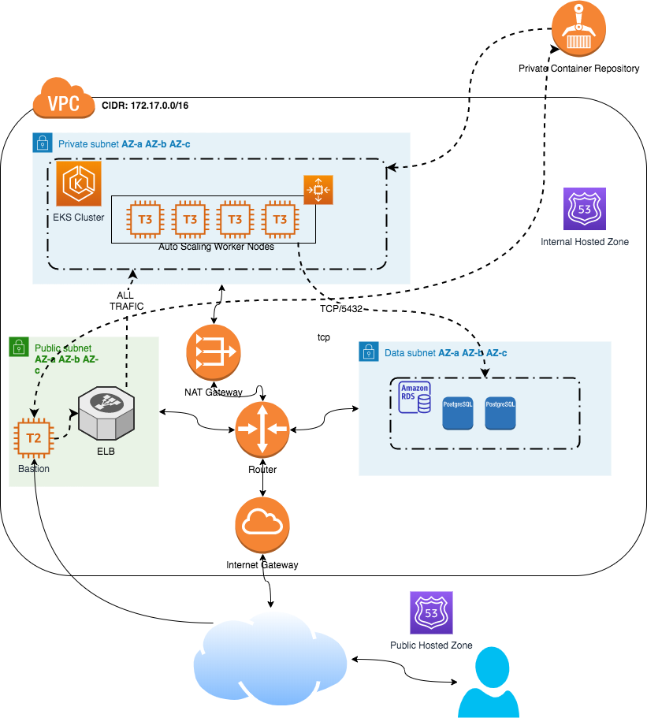

# Revolut Challenge



This Repository contains:
- Infrastructure code in Terraform deploying the architecture at AWS
- K8s deployment files
- Python app exposing a rest API and using PostgreSQL as database

PreReqs:
- AWS account
- AWS service account with admin access
- Terraform installed, version >0.12.
- AWS CLI installed
- Kubectl installed 
- Docker installed
- Internet Connection

IF using MAC OS please include '' at sed commands Ex. sed -i '' 's/.../.../' file

How TO:
1. Clone the repository locally
```git clone https://github.com/gealmei/_revolut-challenge.git```
2. With AWS credentials configured, go to infrastructure directory 
```cd infrastructure``` 
and execute 
```terraform apply -auto-approve```
or fist you can validate the actions with
```terraform plan```

Once the deploy is over you can start the app deployment, go into k8s-deploy
```cd ../k8s-deploy```

1. Get your new VPC ID using 
```aws ec2 describe-vpcs --filters "Name=tag:Name, Values=revolut-challenge" | jq .Vpcs[0].VpcId```
2. With your new VPC ID change the ID information at alb-ingress-controller.yaml
``` sed -i 's\NEW-VPC-ID\<information from last command>\' alb-ingress-controller.yaml
3. Validate if the data is changed ```cat alb-ingress-controller.yaml | gre <information from step 1>```
4.Run the deployment```./deploy.sh```
5.Once finished and the service is running you will be able to retrieve the loadbalancer internal url for tests using the bastion instance deployed previously
```kubectl get ingress/hello-ingress -n hello-app -o json | jq .status.loadBalancer.ingress[0].hostname```
6.Acces the Bastion instance using the key provided
    6.1 Dowload the key
    6.2 Change file permissions using ```chmod 0400 bastion.pem```
    6.3 Access the instance ```ssh -i bastion.pem ec2-user@bastion.revolut.gui.co.uk```

7.Using the information collected at step 5 run
```curl -X PUT -H "Content-type: application/json" http://<internal-alb-domain>/hello/<name> -d '{"dateOfBirthday":"<YYYY-MM-DD>"}'``` TO INSERT DATA
```curl -X GET -H "Content-type: application/json" http://<internal-alb-domain>/hello/<name>``` TO CONSULT DATA
```curl -X GET -H "Content-type: application/json" http://<internal-alb-domain>/api/status``` HEALTHCHECK VALIDATING DB CONNECTION

Testing Locally
1. Go to app directory ```cd ..\app```
2. Run ```sed -i 's/USER/guilherme/' app.py; sed -i 's/PASSWORD/123456/' app.py; sed -i 's/DB-URI/db/' app.py```
3. Run docker-compose up
